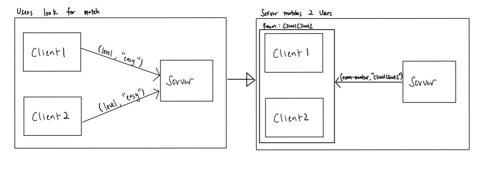
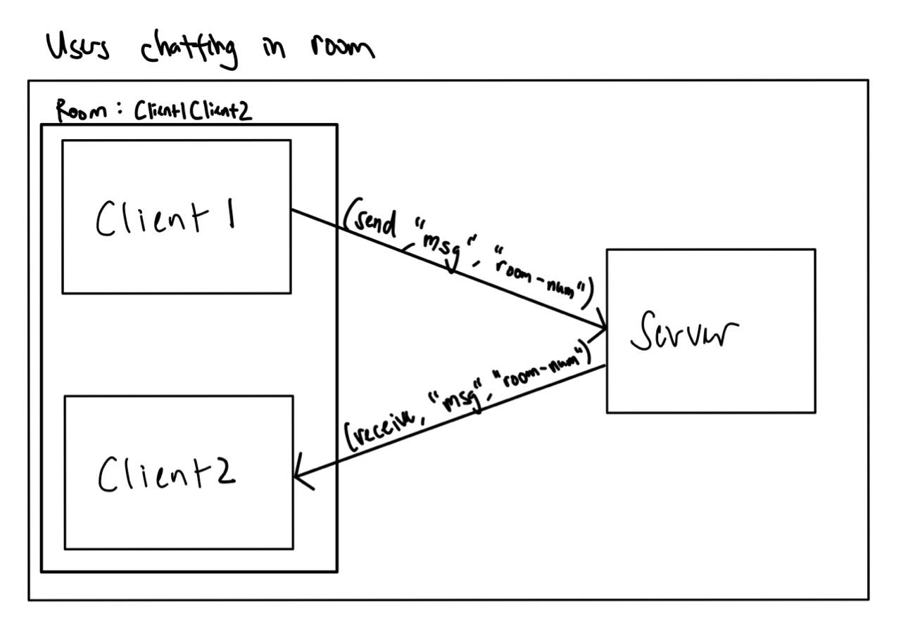

# PeerPrep

- [PeerPrep](#peerprep)
- [Introduction](#introduction)
  - [Background](#background)
  - [Purpose](#purpose)
- [Functional Requirements](#functional-requirements)
  - [User Service](#user-service)
  - [Matching Service](#matching-service)
  - [Question Service](#question-service)
  - [Collaboration Service](#collaboration-service)
  - [Execution Service](#execution-service)
  - [Frontend](#frontend)
- [Non-Functional Requirements](#non-functional-requirements)
  - [Availability Requirements](#availability-requirements)
  - [Performance Requirements](#performance-requirements)
  - [Robustness Requirements](#robustness-requirements)
  - [Security Requirements](#security-requirements)
  - [Scalability Requirements](#scalability-requirements)
  - [Usability Requirements](#usability-requirements)
  - [Integrity Requirements](#integrity-requirements)
  - [Trade-Offs](#trade-offs)
    - [Security vs Performance](#security-vs-performance)
    - [Security vs Usability](#security-vs-usability)
- [Solution Architecture](#solution-architecture)
  - [Overview](#overview)
  - [Service Instance per Container](#service-instance-per-container)
- [Design Decisions](#design-decisions)
  - [Using `y-websocket` for concurrent code editing](#using-y-websocket-for-concurrent-code-editing)
    - [Implementation details](#implementation-details)
      - [Usage in frontend](#usage-in-frontend)
      - [Usage in collaboration service](#usage-in-collaboration-service)
  - [API Gateway as Reverse Proxy](#api-gateway-as-reverse-proxy)
    - [Better security for microservices](#better-security-for-microservices)
    - [Increased cohesion](#increased-cohesion)
  - [Firebase as authenticator for user-service](#firebase-as-authenticator-for-user-service)
    - [Easy sign-in with any platform](#easy-sign-in-with-any-platform)
    - [Comprehensive security](#comprehensive-security)
    - [In-built features](#in-built-features)
    - [Fast implementation](#fast-implementation)
    - [Realtime database](#realtime-database)
    - [Enforcing email verification](#enforcing-email-verification)
  - [Socket.IO for matching-service](#socketio-for-matching-service)
    - [Matching peers](#matching-peers)
    - [Communicating in a room](#communicating-in-a-room)
    - [Why socket.IO?](#why-socketio)
    - [Abstraction layer on top of WebSockets](#abstraction-layer-on-top-of-websockets)
    - [Receiving acknowledgment](#receiving-acknowledgment)
    - [Socket.IO broadcasting and rooms](#socketio-broadcasting-and-rooms)
    - [Sticky Load balancing](#sticky-load-balancing)
    - [Tradeoffs](#tradeoffs)
  - [MongoDB for questions-service](#mongodb-for-questions-service)
  - [Advantages for MongoDB over Firebase](#advantages-for-mongodb-over-firebase)
  - [Use case for choice of database](#use-case-for-choice-of-database)
    - [Usability for Reliability](#usability-for-reliability)
  - [Using Terraform for Infrastructure-as-Code (IaC)](#using-terraform-for-infrastructure-as-code-iac)
- [Design Patterns](#design-patterns)
  - [Singleton](#singleton)
      - [Why we use the singleton pattern:](#why-we-use-the-singleton-pattern)
  - [Observer](#observer)
- [Development Process](#development-process)
  - [Continuous Integration](#continuous-integration)
  - [Manual Re-Deployment](#manual-re-deployment)
    - [Partial Re-Deployment](#partial-re-deployment)
  - [Full Re-Deployment](#full-re-deployment)
  - [Infrastructure as Code](#infrastructure-as-code)
    - [Increase developer productivity](#increase-developer-productivity)
    - [Increase reliability](#increase-reliability)
- [Possible Enhancements](#possible-enhancements)
  - [Code compilation and execution](#code-compilation-and-execution)
  - [History service](#history-service)
    - [Using Firebase's realtime database to store history](#using-firebases-realtime-database-to-store-history)
    - [Reading and writing data](#reading-and-writing-data)
    - [Using React for the frontend](#using-react-for-the-frontend)
- [Reflections and Learning Points](#reflections-and-learning-points)
- [Individual Contributions](#individual-contributions)
  - [Ong Kim Lai](#ong-kim-lai)
    - [Technical Contributions](#technical-contributions)
    - [Non-Technical Contributions](#non-technical-contributions)
  - [Ryan Low Bing Heng](#ryan-low-bing-heng)
    - [Technical Contributions](#technical-contributions-1)
    - [Non-Technical Contributions](#non-technical-contributions-1)
  - [Tang Wei Teck Frederick](#tang-wei-teck-frederick)
    - [Technical Contributions](#technical-contributions-2)
    - [Non-Technical Contributions](#non-technical-contributions-2)
  - [Yeap Yi Sheng James](#yeap-yi-sheng-james)
    - [Technical Contributions](#technical-contributions-3)
    - [Non-Technical Contributions](#non-technical-contributions-3)

# Introduction

## Background

Increasingly, students face challenging technical interviews when applying for jobs which many have difficulty dealing with. Issues range from a lack of communication skills to articulate their thought process out loud to an outright inability to understand and solve the given problem. Moreover, grinding practice questions can be tedious and monotonous.

## Purpose

To tackle these issues, our team is working on PeerPrep: a peer learning system where students can find peers to practice whiteboard-style interview questions together.

In building PeerPrep, we seek to achieve the following objectives:

- Give students an effective way to improve their ability to articulate key technical concepts
- Serve as a platform for students to learn from one another
- Expose students to practice questions that can materially improve their understanding of relevant technical concepts

# Functional Requirements

## User Service

| ID     | Description                                                                            | Priority |
| ------ | -------------------------------------------------------------------------------------- | -------- |
| F-US-1 | The system should allow users to create an account with a username and password.       | High     |
| F-US-2 | The system should ensure that every account created has a unique username.             | High     |
| F-US-3 | The system should allow users to log into their accounts with a username and password. | High     |
| F-US-4 | The system should allow users to log out of their account.                             | High     |
| F-US-5 | The system should allow users to delete their account.                                 | High     |
| F-US-6 | The system should allow users to change their password.                                | Medium   |

## Matching Service

| ID     | Description                                                                                                        | Priority |
| ------ | ------------------------------------------------------------------------------------------------------------------ | -------- |
| F-MA-1 | The system should allow users to select the difficulty level of the questions they wish to attempt.                | High     |
| F-MA-2 | The system should be able to match two waiting users with similar difficulty levels and put them in the same room. | High     |
| F-MA-3 | If there is a valid match, the system should match the users within a reasonable amount of time.                   | High     |
| F-MA-4 | The system should provide a means for the user to leave a room once matched.                                       | Medium   |

## Question Service

| ID     | Description                                                         | Priority |
| ------ | ------------------------------------------------------------------- | -------- |
| F-QU-1 | The system should store a list of questions, indexed by difficulty. | High     |
| F-QU-2 | The system should allow users to retrieve a question by difficulty. | High     |
| F-QU-3 | The system should allow administrators to add additional questions. | High     |

## Collaboration Service

| ID     | Description                                                                             | Priority |
| ------ | --------------------------------------------------------------------------------------- | -------- |
| F-CO-1 | The system should provide a text-editor that is synced between users in the same match. | High     |
| F-CO-2 | The system should allow peers to see each other's cursors and highlights.               | Low      |

## Execution Service

| ID     | Description                                                                    | Priority |
| ------ | ------------------------------------------------------------------------------ | -------- |
| F-EX-1 | The system should provide a compiler for Java and C programs.                  | Medium   |
| F-EX-2 | The system should provide the execution output of Java, C and Python programs. | Medium   |

## Frontend

| ID      | Description                                                                                                        | Priority |
| ------- | ------------------------------------------------------------------------------------------------------------------ | -------- |
| F-FR-1  | The system should provide the user with a login page.                                                              | High     |
| F-FR-2  | The system should provide the user with a registration page.                                                       | High     |
| F-FR-3  | The system should restrict access for unauthorized users to only login and registration pages.                     | High     |
| F-FR-4  | The system should allow toggling between light and dark mode for all pages.                                        | Low      |
| F-FR-5  | The chat box should provide a list of prompts for the "interviewer" to ask the "interviewee".                      | High     |
| F-FR-6  | The system should provide a chat box that allows users in the same match to communicate via text messages.         | High     |
| F-FR-7  | The system should provide the user with a text editor.                                                             | High     |
| F-FR-8  | The text editor should handle syntax highlight for programming language of choice.                                 | Medium   |
| F-FR-9  | The text editor should handle syntax formatting for programming language of choice.                                | Medium   |
| F-FR-10 | The text editor should allow the user to choose between Java, C and Python as their programming language of choice | High     |
| F-FR-11 | The system should provide a non-interactive terminal to display the output of the executed program.                | Medium   |
| F-FR-12 | The system should inform the users that no match is available if a match cannot be found within 30 seconds.        | High     |

# Non-Functional Requirements

## Availability Requirements

| ID     | Description s                                                                   | Priority |
| ------ | ------------------------------------------------------------------------------- | -------- |
| N-AV-1 | The system shall be at least 95% available between 6am and 12am Singapore time. | High     |

## Performance Requirements

| ID     | Description                                                                                                              | Priority |
| ------ | ------------------------------------------------------------------------------------------------------------------------ | -------- |
| N-PE-1 | The collaborative text editor should display changes made by a user to other users in the same match in below 5 seconds. | High     |
| N-PE-2 | Messages sent through the chat box should be received by users in below 5 seconds.                                       | High     |
| N-PE-3 | The system should display the output of the executed programs in under 10 seconds.                                       | Medium   |
| N-PE-4 | If there is a valid match, the system should match the users within 30s.                                                 | High     |

## Robustness Requirements

| ID     | Description                                                                              | Priority |
| ------ | ---------------------------------------------------------------------------------------- | -------- |
| N-RO-1 | The system should not evict the user from the match when the user refreshes the browser. | High     |

## Security Requirements

| ID     | Description                                                            | Priority |
| ------ | ---------------------------------------------------------------------- | -------- |
| N-SE-1 | Users' passwords should be hashed and salted before storing in the DB. | Medium   |
| N-SE-2 | The system should only grant authorized users access to all pages.     | High     |
| N-SE-3 | The system should expire access tokens after 1 hour.                   | High     |

## Scalability Requirements

| ID     | Description                                                     | Priority |
| ------ | --------------------------------------------------------------- | -------- |
| N-SC-1 | The system should be able to handle at least 100 users at once. | Low      |

## Usability Requirements

| ID     | Description                                                                                                     | Priority |
| ------ | --------------------------------------------------------------------------------------------------------------- | -------- |
| N-US-1 | The application should be intuitive enough such that the user does not have to refer to a user guide to use it. | Medium   |

## Integrity Requirements

| ID     | Description                                                                                                                              | Priority |
| ------ | ---------------------------------------------------------------------------------------------------------------------------------------- | -------- |
| N-IN-1 | The collaborative text editor should preserve the work done by the user when the browser is refreshed when the user is still in a match. | High     |

## Trade-Offs

<p align="center">
  
</p>

### Security vs Performance

Our team had to decide whether to authenticate incoming requests for microservices. On one hand, if we didn't authenticate these requests, the response time for these requests would be faster because no checks needed to be done. On the other, not authenticating incoming requests would make the system vulnerable to attacks such as Denial-of-Service (DOS), where bots can flood the microservices with numerous requests and cause slower response times for our users.

We eventually decided to enforce authentication for a select number of endpoints by using an [API Gateway](#api-gateway-as-reverse-proxy) to increase the security and stability of our system, which in our view was worth the slight decrease in performance.

### Security vs Usability

Another issue that we had to consider was whether it was important to [verify the email addresses used for creating accounts](#enforcing-email-verification).

Requiring our users to verify their emails before giving them full access to our application may lead to a tedious user experience. This being the case however, we felt that the inconvenience caused to our users was necessary in order to ensure the security and availability of PeerPrep, as doing so can prevent bots from performing DOS attacks on our web application and causing performance issues for our users.

# Solution Architecture

## Overview

<p align="center" width="1800" height="1498">
  
</p>

## Service Instance per Container

Each microservice is packaged into a Docker container image and deployed in a distinct container using Cloud Run on Google Cloud Platform.

By deploying service instances in separate containers, each microservice can be scaled up or down separately as needed as demand fluctuates, leading to better cost efficiency.

Also, by deploying the service instances in containers instead of virtual machines, start up time is reduced.

# Design Decisions

## Using `y-websocket` for concurrent code editing

A key feature of PeerPrep is the collaborative code editor, which allows users in the same match to work together on a solution to the problem sets.

In short, we had to synchronize the code in the editors of all users in the match:

- When a user edits the code (i.e. by adding or deleting a word), other users' editors should be notified of this change.
- Once a change notification has been received, the editor should update the code.

To improve the user experience, we could also show the current position of other users' cursors and any text highlighted. This would make updates to the code editor less jarring, as users can anticipate changes made by others.

To implement these features, we had two options:

- Option 1: Start with a framework that provides the implementation for these features, or
- Option 2: Write our own synchronization logic

To help us iterate faster, we decided to go with the first option, and searched for open-sourced frameworks that could help us deliver these features to our users.

In our search, we found two promising frameworks:

- [`firepad`](https://github.com/FirebaseExtended/firepad)
- [`y-websocket`](https://github.com/yjs/y-websocket)

These two frameworks had different approaches towards synchronizing data:

- `firepad` works extensively with Google's [Firebase Realtime Database](https://firebase.google.com/docs/database) (a NoSQL database):
  - when a change is made to the code editor, the change is captured in the form of a [`TextOperation`](https://github.com/FirebaseExtended/firepad#database-structure) and added to the database table
  - any clients that are subscribed to updates to this database table would be notified, and would fetch this change in order to update the code editor
- `y-websocket` on the other hand, provides an option to synchronize data using only WebSockets:
  - when a change is made to the code editor, the details of the change operation is sent as a message to a [`y-websocket` server](https://github.com/yjs/y-websocket/tree/master/bin), along with a `room-id` attribute
  - this would trigger to server to send message(s) to all clients sharing the same `room-id` attribute, thereby propagating the change

In short, using `firepad` would involve reading or writing from a NoSQL database, while using `y-websocket` would not.

We decided to use `y-websocket` for the following reasons:

- Lower latency
  - As `y-websocket` eliminates the need to read and write from a database, latency is reduced, allowing our users to receive faster updates and get a better experience.
- Frequency of updates

  - The `firepad` framework is [no longer under active development](https://github.com/FirebaseExtended/firepad#status), with the last update being made on 12 May 2021.

  - In comparison, the `y-websocket` framework is still actively being maintained, which would in turn make maintenance of PeerPrep easier.

- Incompatibility issues with `firepad`
  - In our testing, the team found that `firepad` only supported firebase servers in the North American region, which would increase the latency for users in the Asia Pacific region.

### Implementation details

`y-websocket` is used in both the frontend and collaboration service.

<p align="center">
  
</p>

#### Usage in frontend

When the user begins a match, the code editor is initialized and rendered. During the initialization, `y-websocket` initiates a WebSocket connection with the collaboration service.

When the user interacts with the code editor by modifying the code or changing the cursor's position, these updates are sent to the collaboration service through the WebSocket connection.

`y-websocket` also listens for messages from the collaboration service and updates the code editor with changes made and the activities of other users.

#### Usage in collaboration service

On the collaboration service, `y-websocket` listens for messages sent through WebSocket connections with frontend clients.

When a message is received, `y-websocket` reads the `room-number` attribute in the message and relays it to other frontend clients in the same match. This ensures that users' code editors are only synced if they are in the same match.

## API Gateway as Reverse Proxy

Instead of interacting with the microservices directly, the frontend sends requests to an API gateway, which forwards requests to the relevant microservices.

Our team decided on this approach for two main reasons:

- Better security for microservices
- Increased cohesion

### Better security for microservices

Access to microservices is protected by an API gateway in the following manner:

- If the requested endpoint is unprotected, the API gateway will forward it to the microservice(s) that are responsible for fulfilling the request
- However, if the requested endpoint is protected, the request must provide some credentials for authentication:
  - When the user successfully logs in, an `access token` and `refresh token` will be provided:
    - the `access token` is valid for an hour
    - the `refresh token` will remain valid for an indefinite period of time until either of the following occur:
      - the user logs out
      - the user deletes the account
  - To access protected endpoints, the `access token` must be included in the `Authorization` header as a `bearer token`
    - upon receiving the request, the API gateway will send the `access token` to the User service to verify that the `access token`:
      - has not been tampered with
      - has not expired
    - once the `access token` has been authenticated by the User service, the request will be forwarded to the relevant microservice(s)
      - otherwise, the request will be refused by the API gateway

<p align="center">
  
</p>

### Increased cohesion

Implementing the authentication logic in the API gateway removes this responsibility from the microservices.

This reduces the need for each microservice to implement its own authentication logic and allows it to focus on fulfilling its core function, increasing cohesion and reducing duplication of code.

## Firebase as authenticator for user-service

We used Firebase as our authenticator for user-service. All user services are handled by Firebase Authentication where API calls to the respective functions are made using axios.

### Easy sign-in with any platform

Provides end-to-end identity solution supporting different methods of authentication such as the basic email and password accounts, Google, Twitter, Facebook, Github login etc.

### Comprehensive security

Firebase uses a modified Firebase version of the scrypt hashing algorithm to store passwords. This version is more secure against hardware brute-force attacks than alternative functions such as PBKDF2 or bcrypt. Also, scrypt automatically does password salting on top of password hashing.

### In-built features

Firebase has many in-built features for their authentication system. Some of these useful features that we used were the email address verification and password reset. These allowed us to easily implement an authentication system with all the necessary in-built features that are essential to us.

### Fast implementation

We figured that it can take quite a long time to develop our own authentication system that is reasonably secure and not to mention the need to maintain it in future. Hence, we decided to use Firebase Authentication that is already developed by Google which will allow us to implement a secure auth system quickly and without much hassle.

### Realtime database

In Firebase, here is an in-built realtime database that we can use to store our essential user data. With the integration of Firebase Authentication, it helps to deal with security concerns of users. Also, with Firebase's realtime database, we have the ability to set data permissions as well.

### Enforcing email verification

For every new user, we made use of Firebase's email verification to ensure every user verifies their account. If the user's email account is left unverified, he/she would not be able to use the matching service of PeerPrep. This is to prevent potential bots from performing DOS attacks on our web application and causing unnecessary performance issues.

## Socket.IO for matching-service

### Matching peers

<p align="center">
  
</p>

A client will queue up for a room by emitting the `level` event, with the difficulty level they wish to queue up for. Referring to the example above, both clients have queued up for the easy difficulty
match.

The server socket will be listening on the `level` event, and upon finding 2 compatible clients, will add them into a room. The `room-number` event will be emitted by the server,
to all clients in the room, letting them know that they have successfully joined a room, and with what room number.

[`MatchSelectionPage.js`](https://github.com/CS3219-AY2223S1/cs3219-project-ay2223s1-g22/blob/d174eb58e29f564b852e3c22a8ffdee4fb84d83c/frontend/src/pages/matching-service/MatchSelectionPage.js#L114)

```javascript
const handleRequestMatch = (difficulty) => {
  socketRef.current.emit("level", difficulty, (inQueue) => {
    if (inQueue) {
      showAlreadyQueuedToast();
    } else {
      showFindingMatchModal();
    }
  });
};
```

### Communicating in a room

<p align="center">
  
</p>

If 2 clients are already in the same room, they can communicate using the chat. This chat-service is also done using `socket.IO`.
If `client1` wants to send a message to `client2`, `client1` will emit the `send` event to the server, together with the message and the room number.
The server will be listening on the `send` event, then use the socket to relay the message.

[`index.js`](https://github.com/CS3219-AY2223S1/cs3219-project-ay2223s1-g22/blob/d174eb58e29f564b852e3c22a8ffdee4fb84d83c/matching-service/index.js#L71)

```javascript
socket.on("send", (message, room) => {
  console.info("sending message to room " + room);
  socket.to(room).emit("receive", message);
});
```

### Why socket.IO?

### Abstraction layer on top of WebSockets

Socket.IO is built on top of the WebSocket protocol and provides additional guarantees like fallback to HTTP long-polling and automatic reconnection.

### Receiving acknowledgment

Socket.IO provides a very convenient way to send an event and receive a response. This feature allows us to send acknowledgement to the client that the server has added them to the queue and have/are looking for a match for them.

### Socket.IO broadcasting and rooms

Rooms are arbitrary channels that sockets can join and leave. We used this in conjunction with the broadcasting feature that is also another functionality provided by Socket.IO. When 2 clients have been matched, they are added to the same room. This feature was used to implement our chat service, as messages from the server/another client in the room can easily be broadcast to all sockets in the room.

### Sticky Load balancing

Socket.IO allows us to scale to multiple servers if we need to by using sticky-sessions.

### Tradeoffs

Socket.IO has a much higher memory requirement compared to WebSockets. There is a significant difference in the amount of memory required to handle the same amount of clients, and this could affect the scaling of Socket.IO with high concurrency. This tradeoff can be overlooked as Socket.IO is a much more complex solution as compared to WebSockets or SockJS.

## MongoDB for questions-service

We decided to use MongoDB instead of Firebase as the features used for our user-service are not required for questions-service. MongoDB's primary focus is on data storage. Both Firebase and MongoDB are built to scale. However, MongoDB edges out in terms of robustness and customizability.

## Advantages for MongoDB over Firebase

- Efficient handling of queries and indexing
- Easier manipulation of the document model data structure
- Ideal option for instant access to enormous amounts of data

## Use case for choice of database

For our questions-service requirements, we want a simple database that stores large amounts of data (questions) and can be queried quickly. We do not need authentication features as questions-service will only be accessed by matching-service which already has authentication checks. With that in mind, MongoDB is a better choice to store our questions data in.

<p align="center">
  
</p>

### Usability for Reliability

Matching-service prevents users from being able to join more than one queue or room, which makes it more reliable, as users can expect to always match with an active user. This however, may slightly affect usability as the user will have to ensure that he leaves another match or queue that he is in before joining another one.

## Using Terraform for Infrastructure-as-Code (IaC)

In our development process, the team relied on Terraform to [deploy new features to production](#infrastructure-as-code).

However, Terraform is only one of the many IaC tools currently available. When deciding which to use, we had two options:

- Use a cloud-native IaC tool
  - which in our case would be [Google Cloud Deployment Manager](https://cloud.google.com/deployment-manager/docs), since our team's infrastructure is completely on GCP
  - cloud providers such as AWS and Microsoft Azure also provide their own IaC tools, which are [Cloudformation](https://aws.amazon.com/cloudformation/) and [Azure Resource Manager](https://azure.microsoft.com/en-us/features/resource-manager/) respectively
- Use a cloud-agnostic IaC tool such as Terraform
  - which allows the specification of infrastructure involving multiple cloud-providers

Even though our team is currently only using GCP for infrastructure, we felt that using a cloud-agnostic solution would be more flexible and allow services from other cloud providers to be easily integrated in the future.

# Design Patterns

## Singleton

The singleton pattern is used to ensure that there is only one instance of the client socket created.

[`SocketContext.js`](https://github.com/CS3219-AY2223S1/cs3219-project-ay2223s1-g22/blob/d174eb58e29f564b852e3c22a8ffdee4fb84d83c/frontend/src/pages/matching-service/SocketContext.js#L8)

```javascript
const getSocket = (accessToken, uuid) => {
  if (!socket && accessToken) {
    socket = initSocket(accessToken);
    socket["uuid"] = uuid;
  }
  return socket;
};
```

In the code snippet, the socket is only initialized if there isn't already an existing socket, and if there is, `getSocket' returns that socket.
This makes it so that every client will only have a single socket instance, and that every page will have access to the same socket instance.
Although the sockets are identified by the unique ID provided by firebase, having multiple sockets for a single client will likely
create many bugs and inconsistencies in the matching of peers on the server socket.

#### Why we use the singleton pattern:

- Each client instance should only need one client socket
- The same socket instance needs to be accessible by multiple pages (e.g. match selection and match room page)

## Observer

Our team used the WebSocket protocol extensively for asynchronous communication [between the frontend and microservices](#socketio-for-matching-service).

These features are implemented using the Observer pattern in the following manner:

- A WebSocket object that receives messages from a microservice is instantiated
  - this object is the `Observable`
- A component registers interest in a particular type of message that is received by the WebSocket
  - the component acts as the `Observer` of the WebSocket object

For example, in the page where the user submits requests for a match, we want to look out for notifications from the matching service when a match has been found so that the user can be redirected to the match room page to begin the match.

A code snippet from the frontend implementing this feature is included below:

[`MatchSelectionPage.js`](https://github.com/CS3219-AY2223S1/cs3219-project-ay2223s1-g22/blob/3d94d17a1bb8e100574651e3013fd78e28b36073/frontend/src/pages/matching-service/MatchSelectionPage.js#L77-L90)

```javascript
socket.on("room-number", (roomNumber, question, opponent) => {
  // ... code omitted for brevity

  showMatchFoundToast();
  navigate("/matchroom", {
    state: {
      roomNumber,
      question,
      opponentUid,
    },
  });
});
```

Within the match selection page component, we listen for any incoming messages containing the `room-number`, which the matching service will send to the frontend once a match has been found.

When this message is received, two actions are performed:

- A popup notification is displayed to inform the user that a match has been found
  - done using the `showMatchFoundToast()` method call
- The user is redirected to the match room page
  - done using the `navigate("/matchroom", ...)` method call

More details on the matching process can be found [here](#matching-peers).

# Development Process

## Continuous Integration

The project uses a workflow script to perform testing using GitHub Actions.

When a pull-request to the `main` branch is created, the workflow will run unit tests for each of the services by:

- Building a Docker image from the `test` stage of the service's Dockerfile
- Starting a container from the image
- Invoking the command to execute the unit tests for the service

When all unit tests have been executed without any failures, the workflow ends with a `completed` status.

- If at least one unit test from any service fails, the workflow ends with a `failed` status.
- The completion status of the workflow is reflected in the page of the pull-request on GitHub.

## Manual Re-Deployment

### Partial Re-Deployment

For Milestone 1, the team decided to deploy updates manually to the production environment with Github Actions and Terraform.

When a new feature is introduced to a service, and the code has been merged into the `main` branch, the team would invoke a deployment workflow and specify the service to be updated. This would trigger the deployment workflow to run.

When the deployment workflow runs, the following steps are taken:

- A Docker image is built from the `build` stage of the target service's Dockerfile.
  - The image is tagged with the a unique hash value, which is associated with the current run of the workflow.
- After creation, the image is uploaded to the Google Container Repository.
- The tag of the latest image is passed to the next phase of the workflow, which updates the production environment with Terraform, which:
  - Shuts down all containers in the production environment that are currently running the service
  - Creates new containers using the new Docker image


## Full Re-Deployment

In Milestone 2, we added a workflow to trigger the complete re-deployment of all services.

This workflow would re-deploy all services using the `main` branch in the following order:

1. Frontend
2. API gateway
3. Matching service
4. User service
5. Collaboration service
6. Questions service

## Infrastructure as Code

Our team has chosen to adopt the Infrastructure as Code (IaC) approach to manage and provision infrastructure instead of using manual processes.

We did this for two reasons:

- To increase developer productivity
- To increase reliability

### Increase developer productivity

For each service, we have defined the infrastructure components required in separate Terraform module configuration files:

- To add, modify or remove a component for a service, the team would modify its module configuration file
- A request would then be made to Terraform to update the infrastructure:
  - deploy component(s) added to the configuration file.
  - re-deploy any component(s) whose configurations have been modified
    - eg: the target Docker image of the container
  - shut down component(s) removed from the configuration file

For example, if the team has just merged a pull-request that adds a feature to the user service and wants to increase the number of containers running in production to 3 (perhaps in anticipation of increased user traffic), we can:

1. Update the Terraform module configuration file for the user service to specify a minimum of 3 containers running
2. Build a Docker image from the latest version of the user service and upload it to Google Container Registry (GCR)
3. Trigger Terraform to update the infrastructure, which will:
   - shut down all old containers running the user service
   - create 3 new containers running the latest Docker image of the user service

Thus, using Terraform gives the team an automated way to deploy updates and saves us the time spent on having to log on the GCP console and manually shutting down and creating the containers.

More importantly, this allows us to rapidly deploy updates by simply triggering [a single GitHub workflow](#partial-re-deployment).

### Increase reliability

Having our entire infrastructure documented in code lets us easily revert any changes made, which is handy if we run into any technical issues.

It also allows us to quickly spin up a replica of our infrastructure if any unforeseen event such as a regional service outage happens.

# Possible Enhancements

## Code compilation and execution

Currently, users cannot compile and run the solution that they have worked on during a match.

To make this possible, an [Execution Service](#execution-service) can be set up. This microservice would receive the source code from the frontend, compile it using a suitable compiler, and execute the compiled program with a list of inputs from the user.

Once the execution is complete, the results output by the compiled program will be sent to the frontend; along with any compilation or runtime errors.

## History service

Currently, users are unable to see their past collaborations with other matched users.

Below is the architecture diagram to illustrate the implementation of a history service.

<p width="1800" height="1498" align="center">
  
</p>

### Using Firebase's realtime database to store history

Since we used Firebase as our authenticator, the most efficient and effective way to keep history records of respective users would be to use Firebase's realtime database. Whenever a user creates a new account, their user details would be automatically stored in the realtime database. Each user is stored with their respective uid as the child under the parent "users/".

### Reading and writing data

We can create api requests to write and read data from the realtime database.
At the end of every collaboration session, the details that would be recorded are:

1. Matched user's details
2. Question
3. Collaborated code on code editor
4. Chat log

### Using React for the frontend

The frontend for history service would display the 50 most recent collaborations of the user. The user would be able to see the details of the other matched user, question, chat log and collaborated code. There is also a filter feature where the user would be able to filter based on the following:

1. Difficulty of the question
2. Matched user
3. Keywords of the question

# Reflections and Learning Points

TODO

# Individual Contributions

## Ong Kim Lai

### Technical Contributions

- Implemented questions-service
  - created API calls
  - set up MongoDB Atlas to store questions
- Implemented the frontend UI
  - Log in and sign up page
  - Match room page
  - Light/Dark mode button in Navbar

### Non-Technical Contributions

- Designed the frontend UI using Figma
- Set up project board on Github
- Create issues for Milestone 1
- Documentation for questions-service
  - Documented the choice of MongoDB over Firebase
  - Created sequence diagram for matching-service and questions-service

## Ryan Low Bing Heng

### Technical Contributions

- Implemented `matching-service` using `Socket.IO`

  - Server
    - matching users based on difficulty level
    - communication service between client sockets
    - retrieval and sending of question from `question-service` to client
  - Client (frontend)
    - allowing user to only queue up/join one room

- Implemented API in `questions-service` to get a random question from MongoDB Atlas

### Non-Technical Contributions

- Designed the frontend UI using Figma
- Created the tables for Non-functional requirements and functional requirements
- Documented the use of `socket.IO` in
  - Design decisions
    - How `socket.IO` was used for `matching-service` and for the chat feature
    - Why `socket.IO` was chosen
  - Design patterns:
    - Singleton
      - How and why the pattern was used.

## Tang Wei Teck Frederick

### Technical Contributions

- Implemented user-service
  - created the api calls for user authentication (login, signup, logout etc)
  - created middleware to check for user's access token
- Implemented email verification for each new user signup
  - unverified users are unable to use matching service
- Implemented reset password functionality
- Used firebase realtime database to store basic user information
- Implemented form validation for the frontend of signup page
- Worked on the frontend UI and logic

### Non-Technical Contributions

- Documented the design decisions for firebase
  - included the tradeoffs
- Documented the possible enhancements for match history
  - created an architecture diagram
- Create user-service and frontend issues

## Yeap Yi Sheng James

### Technical Contributions

- Implemented collaborative editor component on frontend
- Set up collaboration service to sync editors of users in the same match
- Developed API gateway
- Wrote GitHub Actions workflow scripts
  - for continuous-integration:
    - to run unit tests on all services for pull-requests to `main` branch
  - for manual deployment:
    - to dockerize services and upload docker images to Google Container Repository (GCR)
    - to trigger re-deployment of selected service on Google Cloud Platform
- Set up deployment environment
  - Wrote Terraform configuration files to define the deployment environment for each service

### Non-Technical Contributions

- Created solution architecture diagrams for project documentation
- Documented the following aspects of the development process:
  - Continuous Integration
  - Manual Deployment
  - Infrastructure as Code
- Documented design decisions made:
  - Using `y-websocket` for concurrent code editing
  - API Gateway as Reverse Proxy
  - Using Terraform for Infrastructure-as-Code (IaC)
- Documented prioritisation of non-functional requirements in a table
  - justified the use of an API gateway and the trade-off between Security and Performance
- Documented the use of the Observer design pattern
